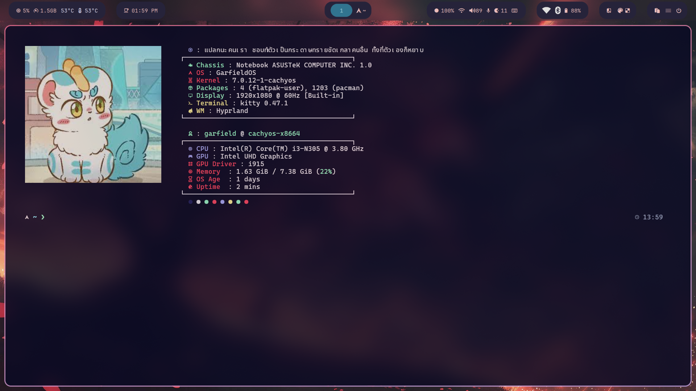

# 🐱 กาฟิวOS Dotfiles "GarfieldOS Dotfiles"

🚧 เป็น prototype นะครับผม**ผมอาจจะขี้โม้ก็ได้ครับ555**

## 🖼️ Preview

---

## 🇺🇸 เวอร์ชั่นอังกฤษ

This project is a **dotfiles configuration for Hyprland on Arch Linux**.

It includes basic setup files for customizing the desktop environment, such as window management, bar, and launcher.

This project is still in development and may be changed or improved over time.

---

## 🇹🇭 ภาษาไทย

โปรเจกต์นี้เป็นชุด **dotfiles สำหรับ Hyprland บน Arch Linux**

ใช้สำหรับตั้งค่าระบบเดสก์ท็อป เช่น การจัดการหน้าต่าง แถบด้านบน และตัว launcher

โปรเจกต์นี้ยังอยู่ระหว่างการพัฒนา และอาจมีการปรับปรุงหรือเปลี่ยนแปลงในอนาคตนะครับผม

**ทำโดยกาฟิว อยู่ชั้นม.2 อายุ 13 นะครับอาจจะไม่ค่อยเก่งเท่าไหร่5555 คอมพังไม่รับผิดชอบเด้อมันunstableอยู่**

ขอขอบคุณsource code ของ HYDE: https://github.com/HyDE-Project/HyDE ด้วยนะครับ
